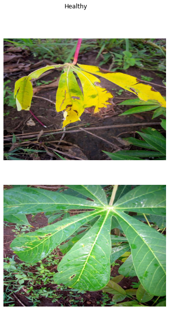
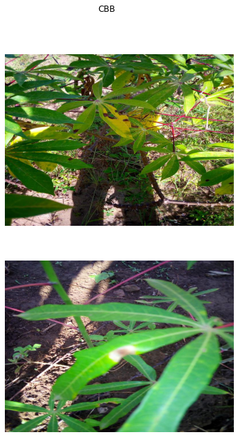
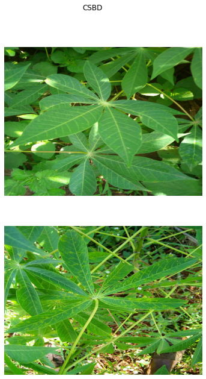
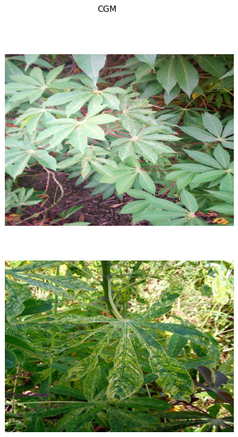
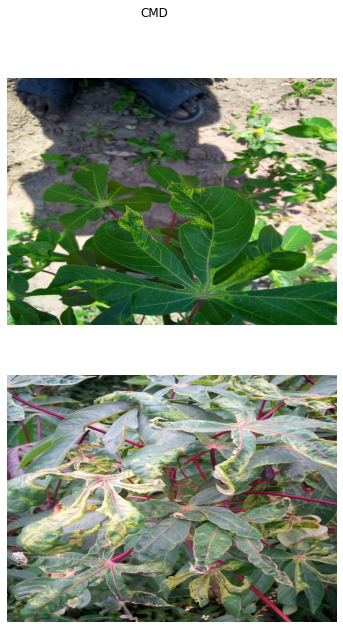
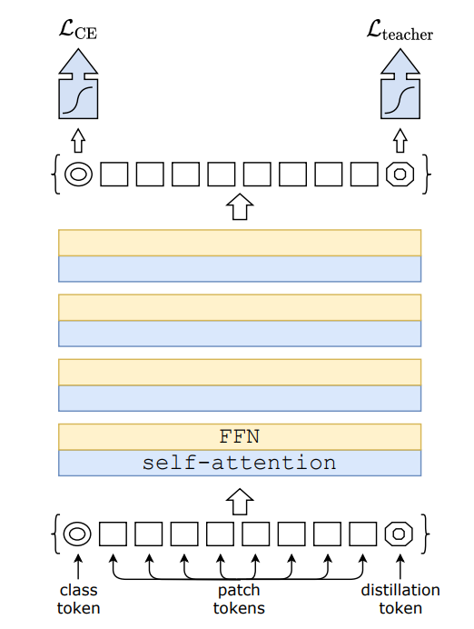
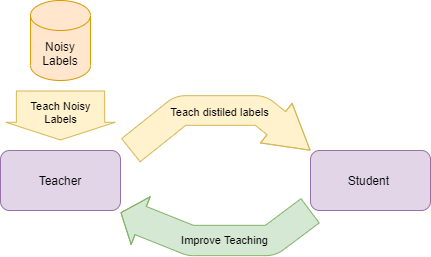

# Cassava Leaf Disease Classification

The objective of this project is to be able to discriminate
from 4 of the most common leaf disease that infect cassava
crops. To do this, we will use the last fine grained visual
classification techniques. Being able to discriminate disease
with a picture taken from a cheap phone could help a
lot farmers improve yields. We will focus on training models with noisy labels.

Here we can see a sample of the different diseases we try to identify

| Healthy Crops             | Cassava Bacterial Blight                   | Cassava Brown Streak Disease                  | Cassava Green Mottle                  | Cassava Mosaic Disease                  |
| --------------------------------- | -----------------------------             | ---------------------------------------- | ---------------------------------------- | ---------------------------------------- |
|  |      |    |    |    |

We based our model on Vision Transformers and in particular the DeiT model by Touvron et al 2020. The following is taken from the ViT paper and the DeiT paper and explain the architectures:

The ViT model takes an image, transforms it into NxN tokens which are then fed into a transformer

The DeiT model is a ViT trained with data efficiency in mind, which makes it a prime candidate for transfer learning. The model is trained with a distillation process from a CNN teacher.

In our approach, instead of having a CNN teacher we perform self distilation. The DeiT gets a student head and a teacher head and both models improves one another. The teacher feed labels to the student and the student gives feedback to the teacher so that it can teach better.

